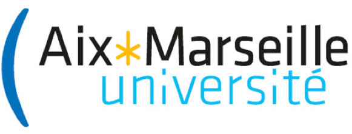

# PSTALN

Prédictions structurées pour le traitement automatique du langage naturel (PSTALN)

Master IAAA Intelligence Artificielle & Apprentissage Automatique (M2)

------

# Program

### Week1

+ Word Embeddings
+ Contextualized Word Representations

### Week2

+ Convolutional Neural Networks (CNN) in NLP
+ Recurrent Neural Networks (RNN) in NLP

### Week3

+ Structured Prediction
+ Semantic Frame Parsing
+ Label Encodings

### Week4

+ Advanced Architectures
+ CRF models
+ Viterbi Decoding
+ Beam Search

### Week5

+ Neural Attention Models
+ Language Models
+ Adversarial Models

